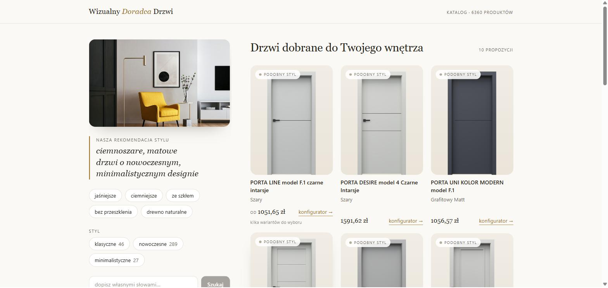

# Visual Product Recommender

[🇬🇧 English](README.md) · **🇵🇱 Polski**

**Co to robi** wgrywasz zdjęcie wnętrza, dostajesz drzwi dopasowane kolorem
i stylem. Potem zawężasz wynik słowami, na przykład „coś ciemniejszego", „bez szyby",
„w stylu loft", bez wgrywania zdjęcia od nowa.



*Ciemne, nowoczesne wnętrze na grafitowe i szare drzwi. Opis stylu po lewej generuje
model, filtry pod nim zawężają wynik.*

## Dlaczego samo podobieństwo nie wystarcza

Drzwi dobiera się okiem, a klient mówi słowami. Wyszukiwarka musi ogarnąć jedno i drugie
naraz.

Wektory łapią podobieństwo i na tym się kończą. Kto prosił o drzwi bez przeszklenia,
dostawał drzwi z szybą. Kto prosił o czarne, dostawał ciemny brąz. Zmiana promptu tu nie
wystarczała, bo wektor nie mógł zakodować ani zaprzeczenia, ani twardego koloru.

Zatem przy imporcie każdego produktu wyliczam trzy atrybuty i zapisuję je razem z nim
w bazie: rodzinę koloru, obecność szyby i styl. Wyszukiwarka filtruje po nich twardo
w tym samym zapytaniu, w którym liczy podobieństwo. Resztę podobieństwa udaje się
wyciągnąć z wektora.

## Jak to działa

```
NA ŻYWO, przy każdym wyszukaniu
  zdjęcie wnętrza → Gemini Flash → CLIP ViT-B/32 ┐
                    opisuje         opis na wektor │
                                                   ├→ ChromaDB → MMR + dedup → 10 propozycji
RAZ, przy imporcie katalogu                        │   podobieństwo   zwija powtórki
  feed XML → atrybuty produktu ────────────────────┘
             kolor · szkło · styl      (filtry where)
```

Twarde filtry nie są osobnym etapem. Wchodzą do zapytania obok wektora, bo tylko wtedy
„bez przeszklenia" naprawdę znaczy zero szyb.

### Co się dzieje w kroku „MMR + dedup"

Bez tego etapu pierwsza dziesiątka wyników to często dziesięć prawie identycznych drzwi.
Dzieje się to z dwóch różnych powodów, więc i lekarstwa są dwa.

**Zwijanie wariantów (dedup).** Feed ma po kilka pozycji o identycznej nazwie: ten sam
model w tym samym kolorze, ale z różnych linii cenowych. W siatce wyglądają jak powtórki
tego samego produktu. Zwijam je więc do jednej karty, pokazuję najlepiej dopasowany
wariant, cenę najtańszego („od 1 051 zł") i informację, ile wariantów czeka
w konfiguratorze.

**Dywersyfikacja (MMR).** Nawet po zwinięciu powtórek wyszukiwanie po podobieństwie lubi
zwrócić dziesięć wariacji jednego pomysłu, bo wszystkie leżą blisko zapytania. MMR
(Maximal Marginal Relevance) wybiera dziesiątkę z większej puli kandydatów, oceniając
każdy kolejny nie tylko za dopasowanie do zapytania, ale też za to, jak bardzo różni się
od już wybranych.

## Proces powstawania aplikacji

| Krok | Artefakt |
|---|---|
| 1. Burza mózgów: czego naprawdę chcę | rozmowa |
| 2. Specyfikacja projektowa | `docs/superpowers/specs/`, **9 dokumentów** |
| 3. Plan wdrożenia rozbity na zadania | `docs/superpowers/plans/`, **11 dokumentów** |
| 4. Implementacja test-first, zadanie po zadaniu | 259 testów |
| 5. Ręczne przeklikanie przez użytkownika (mnie) wg scenariusza | `docs/manual-review-checklist.md` |
| 6. Dziennik decyzji i wyników negatywnych | `docs/otwarte-zadania.md` |

Konwencje pracy siedzą w `CLAUDE.md`. Claude Code czyta ten plik na starcie każdej sesji.

## Gdzie model się mylił najczęściej

Każdy z tych czterech błędów przeszedł przez testy. Wyszły dopiero wtedy, gdy usiadłem
i obejrzałem prawdziwe wyniki na prawdziwym feedzie.

**1. Zielone drzwi zaklasyfikowane jako czarne.**
Automat ustalił: kolor czarny. Naprawdę: zieleń szałwiowa. Wybarwienie „Szałwia" nie
miało własnej reguły, więc klasyfikacja spadła na angielski opis od modelu. A tam słowo
*black* opisywało **czarną szybę**, nie skrzydło. Zapytanie „drzwi czarne" zwracało
zielone drzwi. 68 wariantów z błędnym kolorem.

**2. Czarne drzwi zaklasyfikowane jako białe.**
Automat ustalił: kolor biały. Naprawdę: czarna rama. Linia czystych tafli szklanych
nazywa wariant typem szyby, na przykład „Szyba matowa". Opis brzmiał *white frosted*, co
dotyczyło **mleczności szkła**, nie ramy. Rama w każdym z tych 11 SKU jest czarna.

**3. Drzwi wejściowe udające wewnętrzne.**
Automat zgadywał typ z nazwy. Naprawdę: typ stoi wprost w feedzie. Wszystko
nierozpoznane lądowało jako „wewnętrzne", razem z drzwiami technicznymi, przesuwnymi
i wejściowymi do mieszkania. 1 919 wariantów w 88 modelach; katalog zszedł z 10 873
rekordów do 6 360.

**4. Licznik wariantów liczył nie ten zbiór.**
Automat liczył warianty w puli wyszukiwania. Naprawdę chodziło o warianty w całym
katalogu. Karta pokazywała liczbę widzianą w tym jednym wyszukiwaniu, więc prawie nigdy
nie zgadzała się z konfiguratorem producenta. Liczba prawdziwa, ale odpowiadająca na złe
pytanie.

Czyli to pokazało realną pracę human in the loop: **testy pilnują, czy kod robi to, co
napisano. Nie pilnują, czy napisano to, co trzeba.** Wszystkie cztery błędy przeszły
przez 259 zielonych testów i wyszły dopiero przy oglądaniu prawdziwych drzwi.

## A czego się nie dało zrobić?

Rozpoznawania stylu zgodnego z rzeczywistością.

Weźmy styl skandynawski. Jeden model drzwi występuje w kilkunastu kolorach, a styl
przypisuję do całego modelu, nie do pojedynczego koloru. Dla większości stylów to działa:
drzwi loftowe są loftowe niezależnie od tego, czy są czarne, czy dębowe.

Ze skandynawskim tak nie jest, bo tu właśnie o kolor chodzi. O jasne drewno. Ten sam
model w ciemnym dębie już skandynawski nie jest. A że prawie każdy model ma zarówno
jasne, jak i ciemne wybarwienia, żaden nie zbiera dość głosów od modelu, żeby dostać tę
etykietę.

## W liczbach

| | |
|---|---|
| Commity | 134 |
| Testy | 259 |
| Produkty | 6 360 |
| Modele | 513 |
| Specyfikacje | 9 |
| Plany | 11 |

## Stack

| Warstwa | Technologia |
|---|---|
| Frontend | React 19 · TypeScript · Vite · Tailwind |
| Backend | Node.js · Express 5 · TypeScript |
| Embeddingi | CLIP ViT-B/32 przez FastAPI (sidecar w Pythonie) |
| Baza wektorowa | ChromaDB |
| Model językowy | Gemini Flash: opis wnętrza i uzasadnienia |
| Narzędzie | Claude Code |

Wyniki lecą strumieniem NDJSON: najpierw etapy postępu, potem wyniki, na końcu
uzasadnienia. Dzięki temu generowanie tekstu nie opóźnia samego wyszukiwania.

## Uruchomienie

Wymaga Node.js, Pythona i klucza API do Google AI Studio. Cztery procesy:

```bash
# 1. baza wektorowa
chroma run --path ./chroma_db --port 8000

# 2. model CLIP (pierwsze uruchomienie ładuje model, ~30 s)
cd python-sidecar && venv\Scripts\activate && uvicorn main:app --port 8001

# 3. backend
cd backend && npm run dev          # http://localhost:3001

# 4. frontend
cd frontend && npm run dev         # http://localhost:5173
```

Skopiuj `backend/.env.example` do `backend/.env` i wstaw własny klucz Gemini. Katalog
importujesz z panelu administratora w UI (feed produktowy XML).

Uwagi eksploatacyjne: `CLAUDE.md`.

## Uwaga o danych

Katalog pochodzi z publicznego feedu produktowego XML firmy, w której pracuję. Feed jest
jawnie udostępniany partnerom handlowym i porównywarkom. Aplikacja nie kopiuje zdjęć
produktów, ładuje je prosto z CDN producenta, tak jak każdy partner korzystający z tego
feedu. Jedyny obraz w repozytorium to zrzut ekranu w `docs/assets`, pokazujący działający
interfejs.

Robiłem go po godzinach, na własny rachunek. To nie jest oficjalny produkt producenta.
